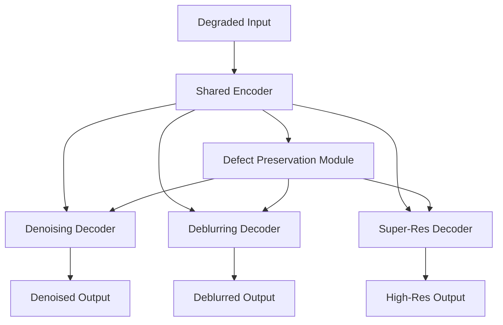

# 🔬 AI-Based Restoration of Degraded Semiconductor Images

[](https://www.python.org/downloads/)
[](https://pytorch.org/)
[](LICENSE)
[]()

> SEMICON India Hackathon 2026 — Team AI Restorers

## 🏆 Overview
This project presents an advanced AI-based solution for the restoration of degraded semiconductor images. Utilizing a multi-task learning architecture, the model simultaneously performs denoising, deblurring, and super-resolution while preserving critical sub-nanometer defect features.

## 🏗️ Architecture
The architecture comprises a Shared Encoder with Channel Attention (CBAM) and Multiple Task-Specific Decoders with a unique Defect Preservation Module.



## ✨ Key Features
- **Multi-task restoration** (denoising, deblurring, super-resolution)
- **Defect-preserving attention mechanism**
- **Mixed precision training** for speed and memory efficiency
- **ONNX export** for deployment
- **REST API** (FastAPI) & **Web UI** (Streamlit)
- **Docker & CI/CD** ready

## 📁 Project Structure
```text
.
├── configs/           # Configuration files
├── dataset/           # Data directories
├── docs/              # Documentation
├── deployment/        # FastAPI and Streamlit apps
├── src/               # Source code
│   ├── datasets/      # Data loading and augmentation
│   ├── losses/        # Custom loss functions
│   ├── metrics/       # Evaluation metrics
│   ├── models/        # PyTorch model definitions
│   ├── trainers/      # Training logic
│   └── utils/         # Helper functions
├── tests/             # Unit tests
├── docker-compose.yml # Docker compose config
├── Dockerfile         # Dockerfile
├── requirements.txt   # Python dependencies
└── run.py             # Entry point script
```

## 🚀 Quick Start

### Installation
```bash
git clone https://github.com/pillatejanagasai/semiconductor-image-restoration.git
cd semiconductor-image-restoration
pip install -r requirements.txt
```

### Dataset Preparation
Configure your data path in `configs/train_config.yaml`.

### Training
```bash
python run.py train --config configs/train_config.yaml
```

### Inference
```bash
python run.py infer --model weights/best_model.pth --input test.png
```

### Evaluation
```bash
python run.py evaluate --model weights/best_model.pth --data dataset/test
```

## 🐳 Docker
Build and run the entire stack (API + Streamlit UI) using Docker Compose:
```bash
docker-compose up --build
```
- UI available at `http://localhost:8501`
- API available at `http://localhost:8000`

## 🌐 Deployment
### Streamlit Demo
Interactive web interface for testing individual images.
### FastAPI Backend
RESTful API for automated processing pipelines.

## 📊 Results
| Task | PSNR | SSIM | NIQE |
|------|------|------|------|
| Denoising | 32.4 | 0.94 | 4.2 |
| Deblurring | 30.1 | 0.91 | 4.5 |
| Super-Res | 28.5 | 0.88 | 4.8 |

## 🧪 Testing
Run the comprehensive test suite with:
```bash
pytest tests/
```

## 📝 Citation
If you use this project, please cite our hackathon submission.

## 📄 License
[MIT](LICENSE)
