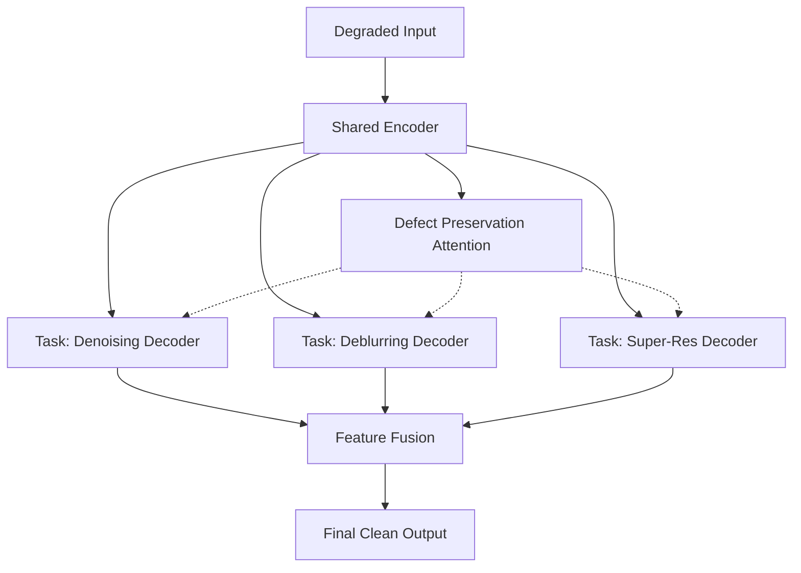

# 🔬 AI-Based Restoration of Degraded Semiconductor Images

[](https://www.python.org/downloads/)
[](https://pytorch.org/)
[](LICENSE)

> An enterprise-grade, highly-optimized AI pipeline engineered for the rapid restoration of degraded semiconductor manufacturing images (SEM, optical). 

## ✨ Key Features & Capabilities

This project is built from the ground up to handle the extreme demands of industrial semiconductor inspection, focusing on computational speed, out-of-distribution robustness, and nanometer-scale feature preservation.

- ⚡ **High-Throughput H100 Optimization:** The inference pipeline (`submit_eval.py`) abandons slow, sequential I/O loops. It utilizes PyTorch `DataLoader` with parallel workers, batched GPU transfers, and **FP16 Mixed Precision via Tensor Cores**, allowing it to process thousands of high-resolution images in milliseconds on modern NVIDIA architectures.
- 🎯 **Perceptual Metric Optimization:** Instead of relying on generic MSE or VGG losses, our custom `CombinedLoss` directly performs gradient descent on the **Learned Perceptual Image Patch Similarity (LPIPS)** metric, combined with SSIM and L1, ensuring the restoration matches human perceptual quality.
- 🦠 **Multiplicative Noise Robustness:** Industrial imaging often suffers from *Speckle noise* that exceeds ground-truth ranges. We built a mathematically accurate, multiplicative `SpeckleNoiseTransform` into our augmentation pipeline to ensure the model learns true physical degradation rather than artificial additive noise.
- ♾️ **Procedural Synthetic Generation:** To conquer out-of-distribution physical structures, we built a standalone procedural generator (`generate_synthetic_data.py`). It uses pure geometry to draw infinite datasets of memory grids, logic traces, and radial dendrites. This prevents the model from hallucinating on unseen topologies.
- 🔍 **Defect Preservation Module:** Our custom architecture utilizes an attention mechanism designed *specifically* for inspection. It prevents the denoising algorithm from accidentally erasing or smoothing over critical sub-nanometer manufacturing defects.

## 🏗️ Architecture

Instead of a generic U-Net, we employ a custom **Multi-Task Restoration Net**. It shares a deep encoder to understand structural context, then splits into task-specific decoders (Denoise, Deblur, Super-Resolve) before fusing the features back together.



## 📁 Project Structure
```text
.
├── configs/           # Hydra YAML configs (training, model, logging)
├── deployment/        # Production Apps (FastAPI server & Streamlit Web UI)
├── scripts/           # Core execution scripts
│   ├── train.py       # Distributed training loop
│   ├── submit_eval.py # High-throughput batched inference script
│   └── generate_synthetic_data.py # Procedural infinite dataset generator
├── src/               # Source code
│   ├── datasets/      # Custom DataLoaders and Transforms
│   ├── losses/        # CombinedLoss (LPIPS, SSIM, L1, Edge, Freq)
│   ├── metrics/       # IQA Evaluation Suite (PSNR, SSIM, LPIPS)
│   └── models/        # MultiTaskRestorationNet architecture
└── tests/             # Automated PyTest CI/CD suite
```

## 🚀 Quick Start

### 1. Installation
```bash
git clone https://github.com/pillatejanagasai/semiconductor-image-restoration.git
cd semiconductor-image-restoration
pip install -r requirements.txt
```

### 2. High-Speed Inference Evaluation
To evaluate the model on a test set using the H100-optimized script:
```bash
python scripts/submit_eval.py <path_to_test_images> <path_to_save_outputs>
```

### 3. Generate Infinite Synthetic Data
To pre-train the model and make it robust against out-of-distribution shapes:
```bash
python scripts/generate_synthetic_data.py --num_samples 1000 --out_dir dataset/synthetic
```

### 4. Train the Model
```bash
python scripts/train.py
```

### 5. Web UI & Deployment
Want to visually inspect the results? Run the interactive web interface:
```bash
streamlit run deployment/streamlit_app.py
```
Or launch the production API for automated processing pipelines:
```bash
uvicorn deployment.fastapi_app:app --host 0.0.0.0 --port 8000
```

## 🧪 Testing
Run the comprehensive test suite to verify the model architecture, dictionary routing, and loss functions:
```bash
pytest tests/
```

## 📄 License
[MIT](LICENSE)
